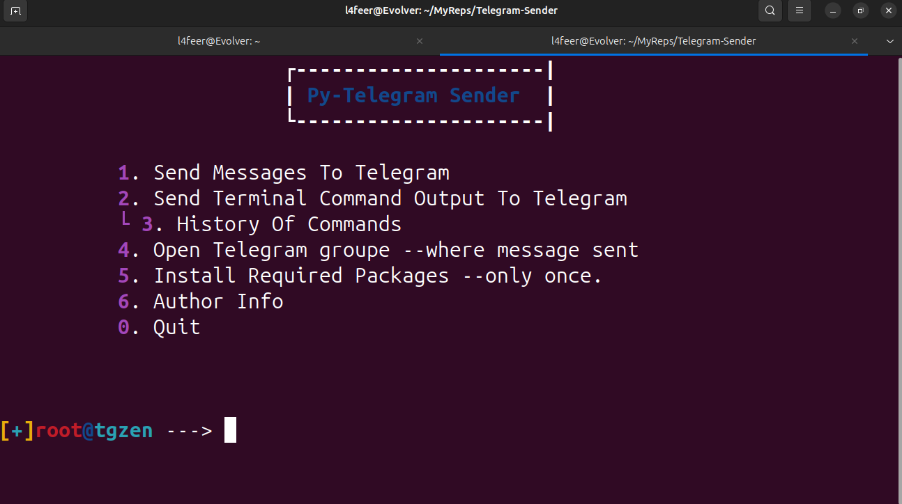

# Telegram-Sender
Send messages as well as terminal command output to a specified telegram group.where token and chat_id were given defaultly, where it can be changed
 

 
 

Steps:

[1/3] Install Required Packages : 

First need to install some packages which is required:

For Linux - Debian :

	sudo apt install python3 -y;sudo pip3 install requests;

For Linux - Arch : 

	sudo pacman -S python3 python3-requests

For Windows :
	pip3 install requests

[2/3] Copying the Script :    <install git, refer internet>

	git clone https://github.com/l4feer/telegram-sender.git --depth=1

[3/3] Running :

	cd Telegram-Sender/;python3 telegram-sender.py

Notes : 

	You can contact me, if u need any help in trying this, i appreciate if u do.
	if u found a bug, feel free to pull a issue
	defautly this chat is connected to my telegram channel, u can add it your own channel, change .conf file according to your channel!

ENJOY!
